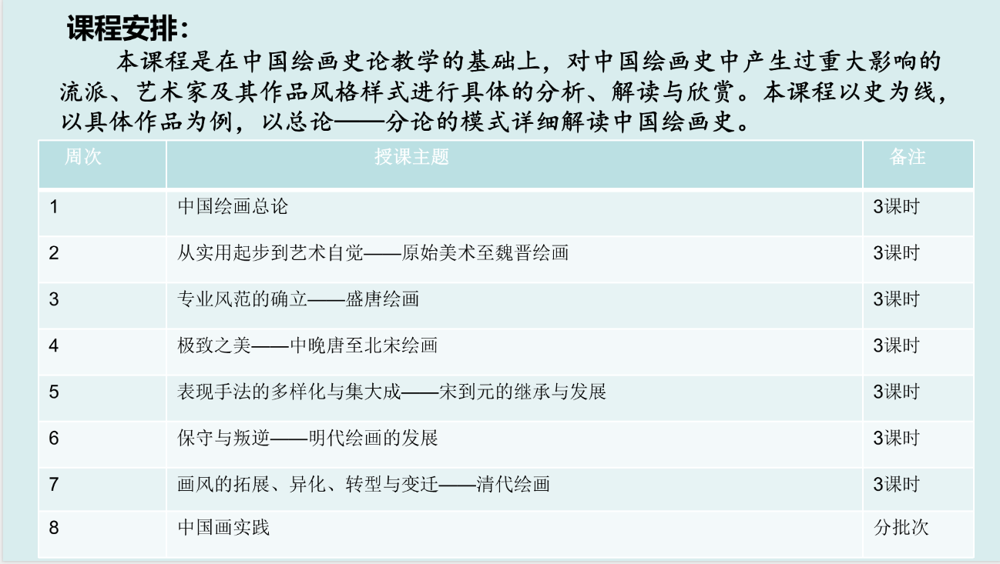

- **任课老师**:高念华
- **学分**:1.5
- **成绩**：96/5.0
- **学期**：2025-2026冬学期

---
# 分数构成

- 考勤：10%
- 小测：30%
- 期末论文：60%
# 课程总结与建议&教师评价

**夯夯夯夯夯爆了**  
作为学生，能感受到高老师是认真备过课的  
老师的讲解非常吸引人，从石器时代讲到明清时期，中国绘画的发展脉络特别清晰，每节课的氛围  也是非常轻松有趣  
并且能学到真东西，真切感受到增长了自己的艺术见闻  
（==这种课才是大学应该开设的啊喂==）  
（唯一的遗憾是这门课是在我最困的时候上的）  

**如果觉得这门课事情多的建议退学捏**  
考勤只要每节课签到  
小测是倒数第二节课，但并不会为难大家，两道选择，一道简答  
最后一节课是实践课，能上手感受一下中国画，very nice  
期末论文建议把本专业和中国画结合起来  
大一上时的我也是很有心气打磨自己的论文  

引用一下我论文结尾的致谢：  
>关于课程，很喜欢高老师课上生动的讲解，对于工科生而言“中国绘画史”这门课是为数不多能得到人文浸润的课程，那些原本只在课本插图里见过的古画，在高老师的讲述中仿佛被注入了生命力，从笔墨技法的演变到画作背后的时代风云，从文人墨客的精神追求到市井百姓的生活百态，都变得鲜活可触。这让习惯了公式、数据与逻辑推演的我，得以跳出理性的框架，去触摸艺术的温度与历史的厚度，在潜移默化中丰盈了内心的人文底色，也为我们看待世界的视角增添了一抹别样的诗意。

最后附上我的拙作：<a href="../eassy-art.pdf" download="潮起墨间——中国海洋主题绘画的演变脉络与艺术特质.pdf">点击下载PDF</a>  